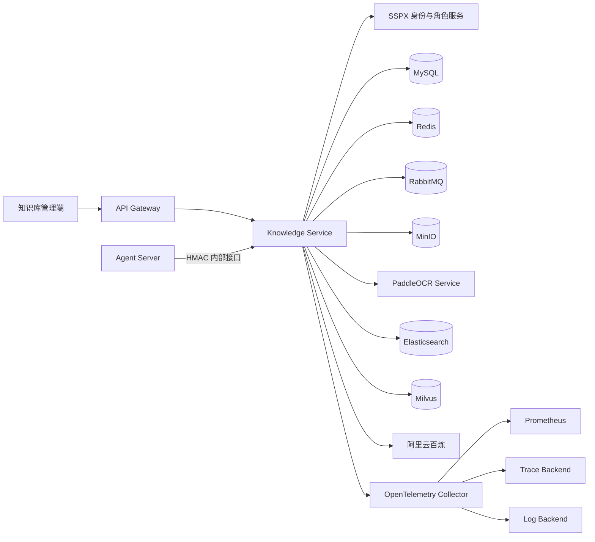

# 享佳智能坐席助手 · Knowledge Service

`order-logistics-knowledge-service` 是享佳智能坐席助手的企业知识与用户记忆检索服务。它负责知识库管理、文档解析与结构化分块、混合检索、证据重排、版本发布和回滚，并向 Agent Server 提供经过租户隔离、发布范围约束和签名校验的内部检索接口。

系统采用 Elasticsearch 关键词召回与 Milvus 向量召回，通过 RRF 融合候选结果，再使用阿里云百炼 Reranker 精排。知识内容只有进入激活的 Release 后才能参与线上检索，避免草稿、失败版本或已回滚内容污染客服回答。

## 核心能力

- **多租户知识库管理**：知识库、文档、版本、发布记录和审计日志均携带租户边界，管理端权限由服务端身份解析结果决定。
- **多格式文档摄取**：支持 PDF、Word、PowerPoint、Excel、CSV、HTML、Markdown、纯文本和图片等内容，图片及扫描件可通过独立 PaddleOCR 服务识别。
- **版面感知解析**：针对 PDF 提取页面文本行、标题层级和重复页眉页脚，保留可追溯的标题路径、页码及来源位置。
- **结构化分块**：按标题、段落和 Token 预算生成稳定 Chunk，控制目标长度、最大长度和重叠窗口。
- **可靠异步入库**：文档处理任务使用 MySQL 持久化状态、Outbox、RabbitMQ 唤醒、任务租约、心跳和有限重试，服务重启后可继续扫描未完成任务。
- **混合检索**：Elasticsearch BM25 与 Milvus 向量检索并行召回，使用 RRF 融合并通过百炼模型重排。
- **版本发布与回滚**：文档新版本先进入草稿索引，Release 激活后再成为线上检索范围；历史 Release 可回滚，旧派生索引由异步任务安全清理。
- **发布范围门禁**：关键词和向量检索都前置过滤当前 ACTIVE Release，返回前再次校验版本范围，防止发布切换期间读取旧版本。
- **用户记忆检索**：为 Agent 的用户记忆提供索引事件写入和混合召回，与企业知识使用独立索引和集合。
- **云模型预算控制**：Embedding 与 Reranker 调用具有月度预算、硬限额、调用台账、成本估算、超时和有限重试。
- **安全内部接口**：Agent 调用使用 HMAC-SHA256 签名，并校验租户、用户、时间戳和一次性 Nonce，防止越权与重放。
- **可观测与可评测**：提供 Prometheus 指标、OpenTelemetry Trace、结构化日志和中文检索 Golden Case 评测工具。

## 系统架构



## 文档摄取链路

```text
上传源文件
  → 校验扩展名、MIME、文件签名和大小
  → MinIO 保存不可变源文件
  → MySQL 创建文档版本、任务与 Outbox 事件
  → RabbitMQ 唤醒 Worker
  → 格式解析 / PaddleOCR
  → 文本规范化与版面结构识别
  → 结构化分块
  → 百炼 Embedding
  → 写入 Elasticsearch 草稿索引与 Milvus 草稿集合
  → 版本进入 READY
```

处理任务以数据库状态为事实来源。RabbitMQ 只负责降低扫描延迟，即使消息丢失，任务扫描器仍会重新发现可执行任务。Worker 通过租约和心跳避免多个实例重复处理同一版本。

## 混合检索链路

```text
查询请求
  → 解析租户与 ACTIVE Release 范围
  → 百炼生成查询向量
  → Elasticsearch 关键词召回 ─┐
  → Milvus 向量召回          ─┤
                               ├→ RRF 融合
                               → 百炼 Reranker 精排
                               → 发布范围最终校验
                               → 返回内容、分数和可追溯引用
```

检索服务允许单路召回暂时不可用时执行受控降级，但不会绕过租户边界、发布范围或最终版本校验。Embedding 不可用时不会伪造向量结果；云模型预算达到硬限额时返回稳定错误，而不是继续产生不可控费用。

### 模型分工

| 模型 | 用途 |
|---|---|
| `qwen3.7-text-embedding` | 文档 Chunk、查询文本及用户记忆的向量化，默认维度 2560 |
| `qwen3.7-text-rerank` | 对 RRF 融合后的候选知识与用户记忆进行相关性重排 |

模型访问统一封装在 Knowledge Service 中，Agent Server 不直接调用 Embedding 或 Reranker 供应商接口。

## Release 发布模型

文档版本和线上发布范围相互独立：

1. 新文件或新版本完成解析和索引后进入 `READY`；
2. 管理员基于一组确定的文档版本创建不可变 Release；
3. Release Worker 校验草稿索引完整性并激活新 Release；
4. 检索端读取 ACTIVE Release 清单，并把版本范围下推至 Elasticsearch 和 Milvus；
5. 发布期间如果 ACTIVE Release 发生变化，本轮检索重新解析范围并有限重试；
6. 回滚通过重新激活历史 Release 完成，不在请求链路中破坏性修改原始文档。

该模型确保“上传成功”不等于“立即上线”，让知识发布具备审核、追踪、回滚和恢复能力。

## 用户记忆

用户记忆与企业知识共享混合检索基础设施，但使用独立索引、集合及检索策略：

- Agent 通过内部接口提交幂等索引事件；
- 服务端按租户和用户维度写入 Elasticsearch 与 Milvus；
- 召回时执行关键词、向量、RRF 和可选重排；
- 返回结果仅包含当前用户可访问的记忆事实；
- 功能可通过配置独立启停，不影响企业知识检索。

## 接口边界

### 管理端接口

```text
GET  /api/v1/admin/auth/csrf
POST /api/v1/admin/auth/login
GET  /api/v1/admin/auth/me
POST /api/v1/admin/auth/logout

GET|POST|PUT|DELETE /api/v1/admin/tenants/{tenantId}/knowledge-bases/**
GET|POST|PUT         /api/v1/admin/tenants/{tenantId}/knowledge-bases/{knowledgeBaseId}/documents/**
GET|POST             /api/v1/admin/tenants/{tenantId}/knowledge-bases/{knowledgeBaseId}/releases/**
POST                 /api/v1/admin/tenants/{tenantId}/knowledge/retrieve
GET                  /api/v1/admin/tenants/{tenantId}/audit-logs
```

管理端使用 SSPX OAuth 登录并建立服务端 Redis Session。修改类请求需要 CSRF Token，租户 ID 会与当前登录身份再次核对，客户端路径参数不能扩大访问范围。

### Agent 内部接口

```text
POST /api/v1/internal/knowledge/retrieve
POST /api/v1/internal/user-memories/index-events
POST /api/v1/internal/user-memories/retrieve
```

内部请求需要以下签名字段：

```text
X-Knowledge-Tenant-Id
X-Knowledge-User-Id
X-Knowledge-Timestamp
X-Knowledge-Nonce
X-Knowledge-Signature
X-Request-Id
```

签名密钥必须通过环境变量或密钥管理系统注入，禁止写入源码、README、镜像或前端配置。

## 技术栈

| 类别 | 技术 |
|---|---|
| 基础框架 | Java 21、Spring Boot 3.5、Spring Cloud、Spring Cloud Alibaba |
| 数据与迁移 | MyBatis-Plus、MySQL、Flyway |
| 状态与异步任务 | Redis、RabbitMQ、Outbox、任务租约 |
| 对象存储 | MinIO |
| 文档解析 | Apache PDFBox、Apache POI、Jsoup、Commons CSV、PaddleOCR |
| 检索 | Elasticsearch 8、Milvus 2、BM25、向量检索、RRF |
| 云模型 | 阿里云百炼 `qwen3.7-text-embedding`、`qwen3.7-text-rerank` |
| 配置中心 | Nacos |
| 安全 | Spring Security、SSPX OAuth、Redis Session、CSRF、HMAC-SHA256 |
| 可观测性 | Micrometer、Prometheus、OpenTelemetry、结构化 JSON 日志 |
| 工程化 | Maven、Docker Compose、JUnit 5、Testcontainers |

## 工程结构

```text
src/main/java/com/xjjk/knowledge
├─ auth           SSPX 登录、角色刷新、管理端 Session 与安全配置
├─ tenant         可信租户上下文与访问边界
├─ knowledgebase  知识库生命周期管理
├─ document       上传、存储、解析、分块、校正和摄取任务
├─ retrieval      Embedding、ES/Milvus 索引、RRF、重排和检索 API
├─ publication    文档发布、Release、回滚及派生索引清理
├─ usermemory     用户记忆索引和混合检索
├─ cloud          百炼调用、重试、预算预留与调用台账
├─ audit          管理操作审计查询
├─ observation    低基数业务指标
└─ common         统一响应、错误码和异常处理

src/main/resources/db/migration  Flyway 数据库迁移
ocr-service                     独立 PaddleOCR HTTP 服务
infra/elasticsearch             Elasticsearch IK 镜像
evaluation                      中文检索 Golden Case 示例
tools                           检索评测脚本
docs                            运行、发布、恢复和验收手册
```
